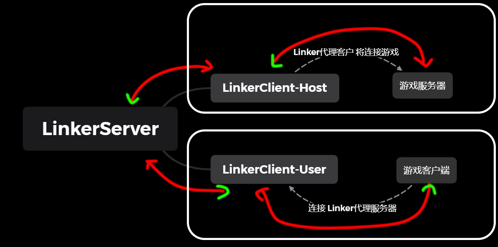
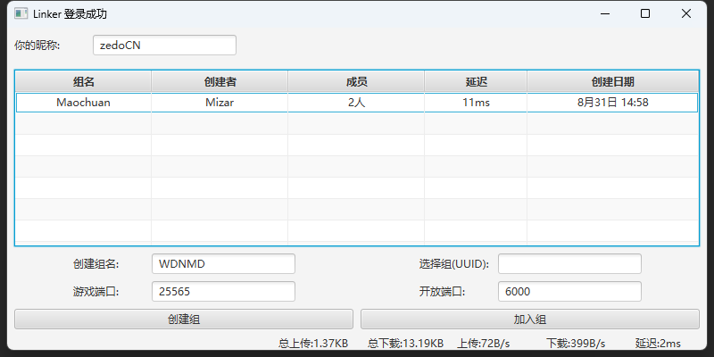
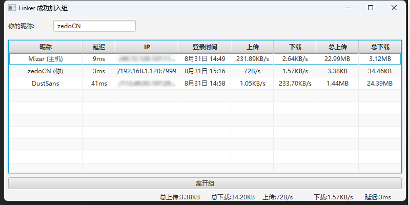

# Linker 流量转发软件 v2.0

## 一、介绍

此项目初衷是想和朋友一起多人联机而制作的联机软件  
可用于 Minecraft、泰拉瑞亚 等游戏多人联机，  
该项目包含服务端和客户端，可自行部署服务器。

### 大致的结构是



## 二、环境需求

需要 Java 20 - [Oracle下载](https://www.oracle.com/java/technologies/downloads/#java20)  
(你也可以自行编译)

## 三、使用教程

### ① 客户端教程

* #### 1.配置客户端
  > ```Linker.cfg```为Linker设置配置文件。比较重要的就是以下两个。
  > - ***linkerServerIp*** 你想要连接Linker服务器的IP地址如 "aaa.bbb.com"
  > - ***linkerServerPort*** 你想要连接Linker服务器的端口如 "1145"
* #### 2.启动客户端
  > 使用命令行执行
  > ```java -jar Linker_Client_v2.0.jar```
  > 启动客户端，之后你可以更改你的昵称。
* #### 3.创建组 (如果你是主机)
  > 填写你的组名并设置游戏端口即可点击创建组按钮，然后等你你的朋友加入到组。
  > - ***创建组名*** 为你想公开的组起个名字。
  > - ***游戏端口*** 你开放的游戏端口  
      (比如 Minecraft 对局域网开放后的端口。)
* #### 4.加入组 (如果你想加入别人的游戏)
  > 在列表会举出当前存在的组，点击你需要加入的组的项目然后点击加入组按钮。
  > - ***开放端口*** 提供给你连接的本地服务器。  
      (比如 Minecraft 多人游戏 添加服务器 输入地址```127.0.0.1:9999```即可连接)

### ② 服务端教程

* #### 1.配置服务端
  > 和上面提到的配置文件一样，只不过服务端只会读取开放的服务器端口。
  >
  > - ***linkerServerPort*** 你想要开放Linker服务器的端口如 "1145"  
      (tip: 如果你想开放给朋友使用，请确保你有公网。)
* #### 2.启动服务端
  >
  > 使用命令行执行
  > ```java -jar Linker_Server_v2.0.jar```
  > 启动服务端后你可以告诉朋友们你的(ip、域名)地址。

## 四、软件截图

* ### 主界面



* ### 组成员界面




